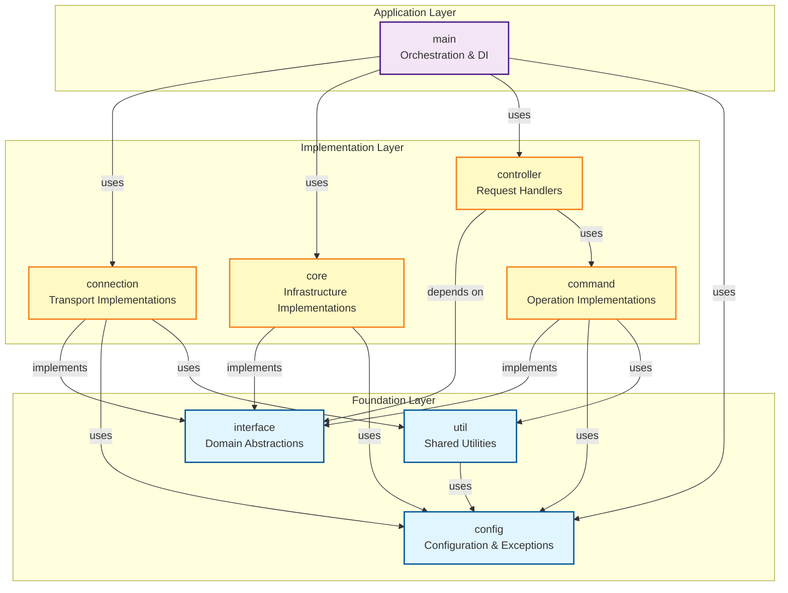

# Declusor Architecture

Declusor is a command-and-control (C2) framework built with clean architecture principles, emphasizing separation of concerns, dependency inversion, and modularity. The architecture follows a layered approach where dependencies flow inward toward domain abstractions, ensuring maintainability and testability.

## Architectural Principles

### 1. Dependency Inversion

- High-level modules depend on abstractions, not concrete implementations
- The `interface` package defines domain contracts that all implementations must follow
- Core infrastructure implements these abstractions without coupling to application logic

### 2. Separation of Concerns

- Each package has a single, well-defined responsibility
- Business logic is isolated from infrastructure concerns
- Application orchestration is separated from implementation details

### 3. Dependency Injection

- The `main` package acts as the composition root
- Dependencies are injected at runtime, not hardcoded
- Controllers receive all required dependencies as parameters

## Layer Architecture



**Legend:**

- **Solid arrows**: Compile-time dependencies (imports)

## Package Responsibilities

### Foundation Layer

#### `interface` (Domain Layer)

Defines abstract contracts for all system components. No external dependencies.

| Interface | Role |
|---|---|
| `IConnection` | Network connection lifecycle; supports context manager protocol |
| `IProfile` | Client configuration data and operation formatting |
| `ICommand` | Executable action within a session context |
| `IRouter` | Route-to-controller mapping and dispatch |
| `IConsole` | All console I/O (input, output, errors) — fully abstract |
| `IPrompt` | Interactive command loop |
| `IParser[T]` | Generic command-line argument parser |
| `Controller` | Type alias: `(IConnection, IConsole, str) -> None` |

#### `config`

Centralized configuration, constants, and exception hierarchy.

| Module | Contents |
|---|---|
| `settings.py` | `Settings` (project metadata), `BasePath` (directory paths) |
| `enums.py` | `ClientFile`, `OperationCode` — only actual enums |
| `exceptions.py` | Exception hierarchy rooted at `DeclusorException` |

Exception hierarchy:

```
DeclusorException
├── ConnectionFailure    # network/transport errors
├── InvalidOperation     # invalid runtime operation
├── ParserError          # CLI argument parsing failure
├── RouterError          # route lookup failure
├── PromptError          # invalid user input
├── ControllerError      # controller execution failure
└── ExitRequest          # graceful shutdown signal (control flow)
```

#### `util`

Stateless utility functions used across all layers. Only depends on `config`.

| Module | Purpose |
|---|---|
| `encoding.py` | Base64, hex, hashing (MD5, SHA-256/384/512) |
| `storage.py` | File loading, path validation |
| `security.py` | File extension and path-relative validation |
| `network.py` | Socket connection context manager |
| `client.py` | Client script template formatting |
| `parsing.py` | Command argument parsing (`Parser`, `parse_command_arguments`) |
| `concurrency.py` | Thread pool and task management (`TaskPool`) |

### Implementation Layer

#### `connection`

Transport-layer implementations. Manages socket connections, ACK-based protocols, and client profiles.

| Class | Role |
|---|---|
| `ShellSocketProfile` | Frozen dataclass holding client config (ACK values, paths, extensions, supported functions). Pure data — no I/O. |
| `ShellSocketConnection` | Implements `IConnection`. Handles socket read/write with ACK framing, connection lifecycle, and all I/O (library loading, client script formatting). Supports context manager. |
| `DEFAULT_SHELL_SOCKET` | Pre-configured profile instance for the default shell socket client. |

#### `core`

Concrete implementations of domain interfaces.

| Class | Implements | Role |
|---|---|---|
| `Router` | `IRouter` | Route table with registration guards and documentation |
| `Console` | `IConsole` | Readline-based console with tab completion and history |
| `PromptCLI` | `IPrompt` | Interactive command loop with routing dispatch |
| `DeclusorParser` | `IParser[DeclusorOptions]` | CLI argument parser for host, port, and client |

#### `command`

Executable operations using the Command design pattern.

| Class | Implements | Purpose |
|---|---|---|
| `ExecuteFile` | `ICommand` | Execute a local script on the remote system |
| `UploadFile` | `ICommand` | Upload a file to the remote system |
| `LoadPayload` | `ICommand` | Load and send a payload file |
| `ExecuteCommand` | `ICommand` | Execute a single shell command |
| `LaunchShell` | `ICommand` | Start an interactive shell session |

#### `controller`

Request handlers that bridge user input to command execution.

| Function | Route | Purpose |
|---|---|---|
| `call_execute` | `execute` | Parse filepath, execute on remote, stream output |
| `call_upload` | `upload` | Parse filepath, upload to remote, stream output |
| `call_load` | `load` | Parse filepath, load payload, stream output |
| `call_command` | `command` | Parse command string, run on remote, stream output |
| `call_shell` | `shell` | Launch interactive shell |
| `call_exit` | `exit` | Raise `ExitRequest` for graceful shutdown |
| `create_help_controller` | `help` | Factory returning a help controller with documentation providers |

Shared via `_helpers.py`: the `_execute_and_read` helper eliminates the duplicated execute → read → display loop across file-based controllers.

### Application Layer

#### `main`

Application bootstrap and dependency injection, split into focused modules.

| Module | Role |
|---|---|
| `__init__.py` | Composition root — creates top-level deps (router, parser, console), calls `run_service` |
| `service.py` | Service orchestration — directory validation, route wiring, connection lifecycle |
| `exception.py` | Exception-to-`SystemExit` mapping for clean CLI error messages |

## Design Decisions

### Why `connection` is separate from `core`?

- `core` implements general infrastructure interfaces (router, console, prompt, parser)
- `connection` is transport-specific — it knows about sockets, ACK protocols, and client profiles
- Keeping them separate allows adding new transport types (HTTP, WebSocket) without touching `core`

### Why `ShellSocketProfile` is a frozen dataclass?

- Profiles are **immutable configuration** — once created, they shouldn't change
- Frozen dataclasses enforce this at runtime
- The profile is pure data — all I/O operations live on `ShellSocketConnection`

### Why `IConsole` is fully abstract?

- All I/O methods (`read_line`, `write_message`, etc.) are abstract
- Prevents mock consoles in tests from accidentally writing to `sys.stdout`
- The concrete `Console` in `core` provides the real `sys.stdout`/`input()` implementations

### Why controllers depend on `interface` instead of `core`?

- Controllers don't need to know about concrete implementations
- Enables dependency injection of any implementation
- Improves testability and flexibility

### Why separate `command` from `controller`?

- Commands encapsulate operations (what to do)
- Controllers handle requests (when to do it)
- Separation allows command reuse across different controllers

### Why `IConnection` supports context manager protocol?

- Ensures `close()` is always called, even on exceptions
- Eliminates `try/finally` boilerplate in `service.py`
- The protocol is concrete on the ABC — subclasses only need to implement `close()`

## Extension Points

To extend the system:

1. **Add a new command**: Create a class implementing `ICommand` in the `command` package
2. **Add a new controller**: Create a function with the `Controller` signature in the `controller` package
3. **Add a new transport**: Create a new module in the `connection` package implementing `IConnection` and `IProfile`
4. **Add a new interface**: Define an abstract base class in the `interface` package
5. **Register the route**: Wire the controller in `main/service.py` via `_set_routes`
