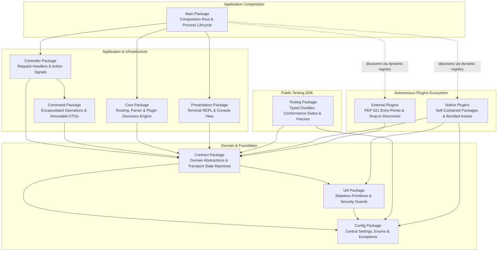
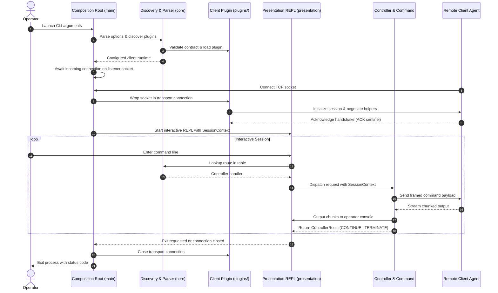

# Declusor Architecture

Declusor is an interactive post-exploitation and command-and-control (C2) framework designed with clean architecture principles. It emphasizes modularity, separation of concerns, and strict dependency inversion. Dependencies flow strictly downward and inward toward domain abstractions, ensuring testability, runtime safety, and seamless extensibility across an autonomous plugin ecosystem.

## 1. Architectural Principles

### 1.1. Dependency Inversion & Contract-First Design

- Higher-level layers and core infrastructure depend strictly on abstract domain contracts, never on concrete implementations.
- The domain layer defines formal interfaces, transport state machines, and session coordinators without framework or transport-specific logic.
- Transport mechanisms and agent runtimes implement these abstractions externally, preventing any coupling between the host engine and concrete protocols.

### 1.2. Autonomous Plugin Self-Contention

- Plugins are fully autonomous packages maintained in independent source trees with individual packaging manifests, assets, and test suites.
- Each plugin encapsulates its own transport implementation, protocol profile, and bundled client assets (stagers, helpers, and payloads).
- **Isolation Invariant**: Core framework code and host unit tests never import concrete plugin packages directly. All coupling is mediated through domain contracts and discovery mechanisms.

### 1.3. Multi-Tier Dynamic Discovery & Validation Barriers

- The system discovers plugins dynamically at runtime across multiple source tiers:
  1. **Built-in Plugins**: Shipped repository packages located in the plugins workspace.
  2. **Python Entry Points**: Standard distribution packages registered via entry points (`declusor.plugins`).
  3. **Operator Directories**: Custom drop-in directories specified via configuration or CLI parameters.
- A strict validation barrier verifies candidate plugins against domain contracts prior to registration, preventing faulty third-party code from compromising runtime stability.

### 1.4. Declarative Signal-Driven Flow Control

- Application controllers return explicit lifecycle signals (`CONTINUE`, `TERMINATE`) wrapped in structured result objects.
- Normal control flow is never driven by exceptions; domain exceptions represent exceptional errors and propagate to central handlers for deterministic reporting and process exit codes.

### 1.5. First-Class Testing SDK & Mock-Free Verification

- Reusable test infrastructure is shipped as a first-class package within the project.
- Tests rely on deterministic, fully-typed test doubles and automated contract conformance suites rather than fragile, untyped mock monkeypatching.

## 2. Layer Architecture & Dependency Model

```mermaid
graph TB
    subgraph "Application Composition"
        MAIN[Main Package<br/>Composition Root & Process Lifecycle]
    end

    subgraph "Application & Infrastructure"
        CONTROLLER[Controller Package<br/>Request Handlers & Action Signals]
        COMMAND[Command Package<br/>Encapsulated Operations & Immutable DTOs]
        CORE[Core Package<br/>Routing, Parser & Plugin Discovery Engine]
        PRESENTATION[Presentation Package<br/>Terminal REPL & Console View]
    end

    subgraph "Domain & Foundation"
        CONTRACT[Contract Package<br/>Domain Abstractions & Transport State Machines]
        UTIL[Util Package<br/>Stateless Primitives & Security Guards]
        CONFIG[Config Package<br/>Central Settings, Enums & Exceptions]
    end

    subgraph "Public Testing SDK"
        TESTING[Testing Package<br/>Typed Doubles, Conformance Suites & Fixtures]
    end

    subgraph "Autonomous Plugins Ecosystem"
        NATIVE_PLUGINS[Native Plugins<br/>Self-Contained Packages & Bundled Assets]
        EXTERNAL_PLUGINS[External Plugins<br/>PEP 621 Entry-Points & Drop-in Directories]
    end

    %% Dependency Flows
    MAIN --> CORE
    MAIN --> CONTROLLER
    MAIN --> PRESENTATION

    CONTROLLER --> COMMAND
    CONTROLLER --> CONTRACT

    COMMAND --> CONTRACT

    CORE --> CONTRACT

    PRESENTATION --> CONTRACT

    CONTRACT --> UTIL
    CONTRACT --> CONFIG

    UTIL --> CONFIG

    TESTING --> CONTRACT
    TESTING --> CONFIG

    NATIVE_PLUGINS --> CONTRACT
    NATIVE_PLUGINS --> CONFIG
    NATIVE_PLUGINS --> UTIL

    EXTERNAL_PLUGINS --> CONTRACT

    MAIN -.->|discovers via dynamic registry| NATIVE_PLUGINS
    MAIN -.->|discovers via dynamic registry| EXTERNAL_PLUGINS
```

### Dependency Rules & Directional Invariants

| Relationship                                                     | Permitted? | Rule / Architectural Invariant                                                |
| :--------------------------------------------------------------- | :--------: | :---------------------------------------------------------------------------- |
| `main` $\to$ `core`, `controller`, `presentation`                |  **Yes**   | Composition root wires concrete components and starts execution.              |
| `controller` $\to$ `command`, `contract`                         |  **Yes**   | Controllers translate requests into commands and dispatch via domain session. |
| `command`, `core`, `presentation` $\to$ `contract`               |  **Yes**   | Components implement or consume domain interfaces.                            |
| `contract` $\to$ `config`, `util`                                |  **Yes**   | Domain interfaces rely only on foundation primitives.                         |
| `util` $\to$ `config`                                            |  **Yes**   | Pure utilities depend only on base exceptions and constants.                  |
| `contract` $\to$ `core`, `command`, `controller`, `presentation` |   **NO**   | Domain abstractions must never depend on implementation layers.               |
| `src/declusor/` $\to$ concrete plugins                           |   **NO**   | Host code must never import specific plugin packages directly.                |
| Production code $\to$ `testing`                                  |   **NO**   | Production packages must never depend on test infrastructure.                 |

## 3. High-Level Layer Responsibilities

### 3.1. Foundation Layer (`config`, `util`)

- **Configuration Base**: Sits at the root of the dependency tree with zero internal dependencies. Centralizes domain exceptions, operational enums, and base filesystem paths.
- **Stateless Primitives**: Provides pure, defensive helpers for encoding, hashing, path sandboxing, cooperative thread pooling, socket listeners, and file storage validation. Uses structural generics to avoid importing domain contracts.

### 3.2. Domain Layer (`contract`)

- **Domain Abstractions**: Defines rigid interfaces for clients, runtimes, connections, commands, controllers, routers, consoles, and parsers.
- **State Machine Invariants**: Enforces strict lifecycle transitions (`CREATED` $\to$ `CONNECTED` $\to$ `CLOSED`) and framed streaming rules for remote transport sessions.
- **Session Coordinator**: Encapsulates active session dependencies (transport connection, operator console, asset file store) and coordinates command execution.

### 3.3. Command & Application Layer (`command`, `controller`)

- **Command Operations**: Encapsulates discrete remote tasks (command execution, script execution, file transfer, modular payload loading, interactive shell spawning) using immutable parameter objects with fail-fast validation.
- **Application Controllers**: Serves as the application orchestration layer. Parses user arguments, constructs commands, coordinates execution through the active session, and signals declarative lifecycle actions back to the view loop.

### 3.4. Infrastructure & Presentation Layer (`core`, `presentation`)

- **Infrastructure Services**: Manages route registration, command usage documentation, command-line argument mapping, and the multi-tier dynamic plugin discovery engine.
- **Presentation (View Layer)**: Handles operator interaction, readline history, autocomplete, stream formatting, and the interactive REPL execution loop. Operates exclusively through domain contracts and controller action signals.

### 3.5. Composition Root (`main`)

- **Application Bootstrap**: Initializes the client registry, discovers plugins across all configured tiers, wires application routes, and executes the active session.
- **Top-Level Error Barrier**: Handles process arguments, captures domain exceptions, prints user-friendly diagnostic messages, and translates results into deterministic operating system exit codes.

### 3.6. Public Testing SDK (`testing`)

- **Contract-Compliant Test Doubles**: Supplies mock-free, deterministic doubles for all domain abstractions, enabling comprehensive testing without physical operating system sockets or external network dependencies.
- **Conformance Harness**: Provides reusable test suites that verify third-party and native plugins against host contract requirements.

## 4. Extensible Plugin Ecosystem

Declusor treats client transports as autonomous, independently versionable packages.

### 4.1. Autonomous Plugin Package Structure

Plugins follow a standard source layout:

- **Package Manifest**: Standalone configuration declaring package metadata, dependencies, and entry-point registration.
- **Source Tree**: Implements the plugin contract, runtime adapter, transport state machine, protocol profile, and asset file store.
- **Bundled Assets**: Embedded launchers (stagers), initialization libraries (helpers), and on-demand payloads (modules).
- **Test Suite**: Dedicated unit and conformance tests isolated within the plugin directory.

### 4.2. Asset Overlay Architecture

Plugins bundle default assets within their own directories. Operators can overlay custom stagers, helpers, or modular payloads at runtime without modifying plugin source code:

1. **Launchers**: One-line stager scripts rendered dynamically with connection host, port, and security tokens.
2. **Helpers**: Library scripts concatenated and evaluated in-memory during session initialization.
3. **Modules**: On-demand operational scripts loaded dynamically during post-exploitation.

## 5. System Execution Flows

```mermaid
sequenceDiagram
    autonumber
    actor Operator
    participant Main as Composition Root (main)
    participant Core as Discovery & Parser (core)
    participant Plugin as Client Plugin (plugins/)
    participant View as Presentation REPL (presentation)
    participant Controller as Controller & Command
    participant Remote as Remote Client Agent

    Operator->>Main: Launch CLI arguments
    Main->>Core: Parse options & discover plugins
    Core->>Plugin: Validate contract & load plugin
    Core-->>Main: Configured client runtime
    Main->>Main: Await incoming connection on listener socket
    Remote->>Main: Connect TCP socket
    Main->>Plugin: Wrap socket in transport connection
    Plugin->>Remote: Initialize session & negotiate helpers
    Remote-->>Plugin: Acknowledge handshake (ACK sentinel)
    Main->>View: Start interactive REPL with SessionContext

    loop Interactive Session
        Operator->>View: Enter command line
        View->>Core: Lookup route in table
        Core-->>View: Controller handler
        View->>Controller: Dispatch request with SessionContext
        Controller->>Remote: Send framed command payload
        Remote-->>Controller: Stream chunked output
        Controller->>View: Output chunks to operator console
        Controller-->>View: Return ControllerResult(CONTINUE | TERMINATE)
    end

    View-->>Main: Exit requested or connection closed
    Main->>Plugin: Close transport connection
    Main-->>Operator: Exit process with status code
```

## 6. Architecture Quality & Safety Invariants

1. **Strict Type Safety**: The entire codebase (core framework, native plugins, and test suites) is verified under strict static type checking with zero untyped public APIs.
2. **Mock-Free Testing**: Internal and external tests use typed test doubles and conformance suites, preventing test fragility caused by mock drift.
3. **Fail-Fast Validation**: Inputs, file paths, and plugin descriptors are validated at system boundaries before entering core execution paths.
4. **Sandboxed File Operations**: All filesystem interactions enforce path-traversal safeguards and extension constraints.
