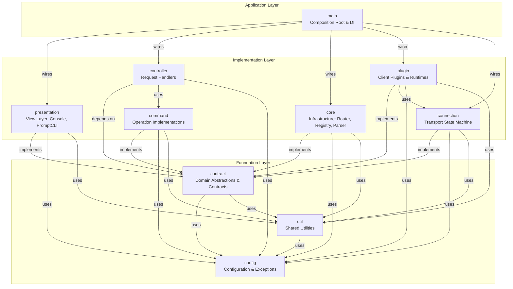

# Declusor Architecture

Declusor is a command-and-control (C2) framework built with clean architecture principles, emphasizing separation of concerns, dependency inversion, and modularity. The architecture follows a layered approach where dependencies flow inward toward domain abstractions, ensuring maintainability and testability.

## Architectural Principles

### 1. Dependency Inversion

- High-level modules depend on abstractions, not concrete implementations
- The `interface` package defines domain contracts that all implementations must follow
- Core infrastructure implements these abstractions without coupling to application logic

### 2. Separation of Concerns

- Each package has a single, well-defined responsibility
- Business logic is isolated from infrastructure concerns
- Application orchestration is separated from implementation details

### 3. Dependency Injection

- The `main` package acts as the composition root
- Dependencies are injected at runtime, not hardcoded
- Controllers receive all required dependencies as parameters

## Layer Architecture

```mermaid
graph TB
    subgraph "Foundation Layer"
        CONFIG[config<br/>Configuration & Exceptions]
        UTIL[util<br/>Shared Utilities]
        CONTRACT[contract<br/>Domain Abstractions & Contracts]
    end

    subgraph "Implementation Layer"
        CORE[core<br/>Infrastructure: Router, Registry, Parser]
        PRESENTATION[presentation<br/>View Layer: Console, PromptCLI]
        CONTROLLER[controller<br/>Request Handlers]
        COMMAND[command<br/>Operation Implementations]
        CONNECTION[connection<br/>Transport State Machine]
        PLUGIN[plugin<br/>Client Plugins & Runtimes]
    end

    subgraph "Application Layer"
        MAIN[main<br/>Composition Root & DI]
    end

    %% Dependencies
    UTIL -->|uses| CONFIG
    CONTRACT -->|uses| CONFIG
    CONTRACT -->|uses| UTIL

    CORE -->|implements| CONTRACT
    CORE -->|uses| CONFIG
    CORE -->|uses| UTIL

    PRESENTATION -->|implements| CONTRACT
    PRESENTATION -->|uses| CONFIG
    PRESENTATION -->|uses| UTIL

    CONNECTION -->|implements| CONTRACT
    CONNECTION -->|uses| CONFIG
    CONNECTION -->|uses| UTIL

    COMMAND -->|implements| CONTRACT
    COMMAND -->|uses| CONFIG
    COMMAND -->|uses| UTIL

    CONTROLLER -->|depends on| CONTRACT
    CONTROLLER -->|uses| COMMAND
    CONTROLLER -->|uses| CONFIG

    PLUGIN -->|implements| CONTRACT
    PLUGIN -->|uses| CONNECTION
    PLUGIN -->|uses| CONFIG
    PLUGIN -->|uses| UTIL

    MAIN -->|wires| PRESENTATION
    MAIN -->|wires| CONTROLLER
    MAIN -->|wires| CORE
    MAIN -->|wires| PLUGIN
    MAIN -->|wires| CONNECTION
```

## Package Responsibilities

### Foundation Layer

#### `contract` (Domain Layer)

Defines abstract contracts for all system components. Depends only on foundation utilities and configuration.

| Interface            | Role                                                                           |
| -------------------- | ------------------------------------------------------------------------------ | ----- |
| `IConnection`        | Network connection lifecycle state machine and framed read/write               |
| `IConnectionProfile` | Client configuration data and shell command formatting                         |
| `ICommand`           | Executable action within a session context (`send_request` -> `read`)          |
| `IRouter`            | Route-to-controller mapping and dispatch                                       |
| `IConsole`           | All console I/O (input, output, errors) — fully abstract                       |
| `IPrompt`            | Interactive command loop                                                       |
| `IParser[T]`         | Generic command-line argument parser                                           |
| `ControllerAction`   | Lifecycle signals (`CONTINUE`, `TERMINATE`)                                    |
| `ControllerResult`   | Action and optional message returned to the presentation loop                  |
| `SessionContext`     | Encapsulates active session (connection, console, files) and executes commands |
| `Controller`         | Type alias: `(SessionContext, ControllerRequest) -> ControllerResult           | None` |

#### `config`

Centralized configuration, constants, and exception hierarchy. Level 0 foundation with zero internal dependencies.

| Module          | Contents                                                             |
| --------------- | -------------------------------------------------------------------- |
| `settings.py`   | `Settings` (project metadata, default ACKs), `BasePath`, `DataPaths` |
| `enums.py`      | `ClientFile`, `OperationCode`                                        |
| `exceptions.py` | Exception hierarchy rooted at `DeclusorException`                    |

#### `util`

Stateless utility functions used across all layers. Depends only on `config`.

| Module           | Purpose                                                        |
| ---------------- | -------------------------------------------------------------- |
| `encoding.py`    | Base64, hex, hashing (MD5, SHA-256/384/512), shell quoting     |
| `storage.py`     | File loading, path validation                                  |
| `security.py`    | File extension and path-relative sandbox validation            |
| `network.py`     | Socket connection context manager with timeout support         |
| `parsing.py`     | Command argument parsing (`Parser`, `parse_command_arguments`) |
| `concurrency.py` | Thread pool and cooperative task management (`TaskPool`)       |

### Implementation Layer

#### `presentation` (View Layer)

User interface and operator interaction components.

| Class       | Implements | Role                                                               |
| ----------- | ---------- | ------------------------------------------------------------------ |
| `Console`   | `IConsole` | Readline-based terminal I/O with autocomplete, history and streams |
| `PromptCLI` | `IPrompt`  | Interactive REPL view loop coordinating controller action signals  |

#### `core`

Application infrastructure services.

| Class            | Implements                 | Role                                                   |
| ---------------- | -------------------------- | ------------------------------------------------------ |
| `Router`         | `IRouter`                  | Route table with registration guards and documentation |
| `ClientRegistry` | N/A                        | Dynamic registry of available client plugins           |
| `DeclusorParser` | `IParser[DeclusorOptions]` | CLI argument parser for host, port, and client options |

#### `connection`

Transport-layer implementations and network lifecycle management.

| Class                   | Role                                                                                                              |
| ----------------------- | ----------------------------------------------------------------------------------------------------------------- |
| `ConnectionState`       | Explicit lifecycle state machine (`CREATED`, `INITIALIZING`, `CONNECTED`, `CLOSED`)                               |
| `ShellSocketProfile`    | Frozen dataclass holding client protocol parameters and operation mappings                                        |
| `ShellSocketConnection` | Implements `IConnection`. Handles TCP socket read/write with ACK framing, stream-safe handshake, and lifecycle.   |
| `ShellSocketFileStore`  | Implements `IClientFileStore`. Reads client bootstrap scripts, loads libraries and validates payload containment. |

#### `command`

Executable operations using the Command design pattern. Commands are pure, stateless operation objects holding only their validated input parameters.

##### Command DTOs

| DTO                 | Invariant Validation                     | Purpose                                           |
| ------------------- | ---------------------------------------- | ------------------------------------------------- |
| `ExecuteCommandDTO` | Non-empty command line string            | Parameters for remote command execution           |
| `ExecuteFileDTO`    | Validated local script file `Path`       | Parameters for script upload and remote execution |
| `UploadFileDTO`     | Validated local file `Path`              | Parameters for file upload without execution      |
| `LoadModuleDTO`     | Non-empty, no traversal (`..`, `/`, `\`) | Parameters for remote module loading              |
| `ShellDTO`          | Optional shell banner message            | Interactive shell configuration                   |

##### Command Classes

| Class            | Accepts DTO         | Implements | Purpose                                                                      |
| ---------------- | ------------------- | ---------- | ---------------------------------------------------------------------------- |
| `ExecuteFile`    | `ExecuteFileDTO`    | `ICommand` | Execute a local script on the remote system                                  |
| `UploadFile`     | `UploadFileDTO`     | `ICommand` | Upload a file to the remote system without executing it                      |
| `LoadModule`     | `LoadModuleDTO`     | `ICommand` | Load and transmit an operator module from `data/modules`                     |
| `ExecuteCommand` | `ExecuteCommandDTO` | `ICommand` | Execute a single remote shell command string                                 |
| `LaunchShell`    | `ShellDTO` (opt)    | `ICommand` | Interactive bidirectional shell session with cooperative thread coordination |

#### `controller`

Request handlers converting user input into command execution and returning presentation signals.

| Function                 | Route     | Purpose                                                                 |
| ------------------------ | --------- | ----------------------------------------------------------------------- |
| `call_execute`           | `execute` | Parse filepath, execute on remote, return `ControllerAction.CONTINUE`   |
| `call_upload`            | `upload`  | Parse filepath, upload to remote, return `ControllerAction.CONTINUE`    |
| `call_load`              | `load`    | Parse module name, load module, return `ControllerAction.CONTINUE`      |
| `call_command`           | `command` | Parse command string, run on remote, return `ControllerAction.CONTINUE` |
| `call_shell`             | `shell`   | Launch interactive shell, return `ControllerAction.CONTINUE`            |
| `call_exit`              | `exit`    | Cleanly return `ControllerAction.TERMINATE` to stop prompt loop         |
| `create_help_controller` | `help`    | Factory returning help controller with route documentation              |

Shared via `_helpers.py`: the `_execute_and_read` helper eliminates the duplicated execute → read → display loop across file-based controllers.

### Application Layer

#### `main`

Application bootstrap and dependency injection, split into focused modules.

| Module         | Role                                                                                     |
| -------------- | ---------------------------------------------------------------------------------------- |
| `__init__.py`  | Composition root — creates top-level deps (router, parser, console), calls `run_service` |
| `service.py`   | Service orchestration — directory validation, route wiring, connection lifecycle         |
| `exception.py` | Exception-to-`SystemExit` mapping for clean CLI error messages                           |

## Design Decisions

### Why `connection` is separate from `core`?

- `core` implements general infrastructure interfaces (router, console, prompt, parser)
- `connection` is transport-specific — it knows about sockets, ACK protocols, and client profiles
- Keeping them separate allows adding new transport types (HTTP, WebSocket) without touching `core`

### Why `ShellSocketProfile` is a frozen dataclass?

- Profiles are **immutable configuration** — once created, they shouldn't change
- Frozen dataclasses enforce this at runtime
- The profile is pure data — all I/O operations live on `ShellSocketConnection`

### Why `IConsole` is fully abstract?

- All I/O methods (`read_line`, `write_message`, etc.) are abstract
- Prevents mock consoles in tests from accidentally writing to `sys.stdout`
- The concrete `Console` in `core` provides the real `sys.stdout`/`input()` implementations

### Why controllers depend on `interface` instead of `core`?

- Controllers don't need to know about concrete implementations
- Enables dependency injection of any implementation
- Improves testability and flexibility

### Why separate `command` from `controller`?

- Commands encapsulate operations (what to do)
- Controllers handle requests (when to do it)
- Separation allows command reuse across different controllers

### Why `IConnection` supports context manager protocol?

- Ensures `close()` is always called, even on exceptions
- Eliminates `try/finally` boilerplate in `service.py`
- The protocol is concrete on the ABC — subclasses only need to implement `close()`

## Extension Points

To extend the system:

1. **Add a new command**: Create a class implementing `ICommand` in the `command` package
2. **Add a new controller**: Create a function with the `Controller` signature in the `controller` package
3. **Add a new transport**: Create a new module in the `connection` package implementing `IConnection` and `IProfile`
4. **Add a new interface**: Define an abstract base class in the `interface` package
5. **Register the route**: Wire the controller in `main/service.py` via `_set_routes`
