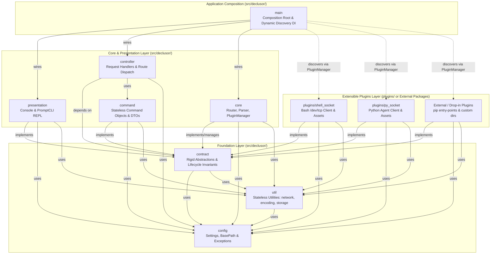

# Declusor Architecture

Declusor is an interactive post-exploitation and command-and-control (C2) framework built with clean architecture principles, emphasizing separation of concerns, dependency inversion, and extensible modularity. Dependencies flow inward toward domain abstractions (`contract`), ensuring testability and runtime flexibility.

## Architectural Principles

### 1. Dependency Inversion

- High-level modules and framework infrastructure depend on domain abstractions, not concrete implementations.
- The `contract` package defines strict contracts (`IClientPlugin`, `IClientRuntime`, `IConnection`, `ConnectionState`, `ICommand`, etc.).
- Concrete plugins implement these abstractions without coupling the core engine to any specific transport.

### 2. Autonomous Plugin Self-Contention (Colocation)

- Plugins are fully self-contained packages located outside `src/` under `plugins/` or distributed as standalone pip packages.
- Each plugin bundles its own plugin class, runtime adapter, connection state machine, profile, and embedded assets (`launchers/`, `helpers/`, `modules/`).
- No concrete client logic or hardcoded client files exist in the core `src/declusor/` codebase.

### 3. Multi-Tier Dynamic Discovery

- `PluginManager` discovers and registers client plugins across three tiers:
  1. **Built-in / Repository plugins** (`plugins/` directory).
  2. **Python Entry Points** (`group="declusor.plugins"` via PEP 621 / pip).
  3. **Drop-in / User directories** (`~/.declusor/plugins/` or CLI `--plugin-dir`).
- Strict contract validation barriers ensure only well-formed plugins are registered.

## Layer Architecture

```mermaid
graph TB
    subgraph "Foundation Layer (src/declusor/)"
        CONFIG[config<br/>Settings, BasePath & Exceptions]
        UTIL[util<br/>Stateless Utilities: network, encoding, storage]
        CONTRACT[contract<br/>Rigid Abstractions & Lifecycle Invariants]
    end

    subgraph "Core & Presentation Layer (src/declusor/)"
        CORE[core<br/>Router, Parser, PluginManager]
        PRESENTATION[presentation<br/>Console & PromptCLI REPL]
        COMMAND[command<br/>Stateless Command Objects & DTOs]
        CONTROLLER[controller<br/>Request Handlers & Route Dispatch]
    end

    subgraph "Application Composition (src/declusor/)"
        MAIN[main<br/>Composition Root & Dynamic Discovery DI]
    end

    subgraph "Extensible Plugins Layer (plugins/ or External Packages)"
        SHELL[plugins/shell_socket<br/>Bash /dev/tcp Client & Assets]
        PYTHON[plugins/py_socket<br/>Python Agent Client & Assets]
        EXTERNAL[External / Drop-in Plugins<br/>pip entry-points & custom dirs]
    end

    %% Dependencies
    UTIL -->|uses| CONFIG
    CONTRACT -->|uses| CONFIG
    CONTRACT -->|uses| UTIL

    CORE -->|implements/manages| CONTRACT
    CORE -->|uses| CONFIG
    CORE -->|uses| UTIL

    PRESENTATION -->|implements| CONTRACT
    PRESENTATION -->|uses| CONFIG
    PRESENTATION -->|uses| UTIL

    COMMAND -->|implements| CONTRACT
    COMMAND -->|uses| CONFIG
    COMMAND -->|uses| UTIL

    CONTROLLER -->|depends on| CONTRACT
    CONTROLLER -->|uses| COMMAND
    CONTROLLER -->|uses| CONFIG

    MAIN -->|wires| PRESENTATION
    MAIN -->|wires| CONTROLLER
    MAIN -->|wires| CORE

    SHELL -->|implements| CONTRACT
    SHELL -->|uses| CONFIG
    SHELL -->|uses| UTIL

    PYTHON -->|implements| CONTRACT
    PYTHON -->|uses| CONFIG
    PYTHON -->|uses| UTIL

    EXTERNAL -->|implements| CONTRACT
    EXTERNAL -->|uses| CONFIG
    EXTERNAL -->|uses| UTIL

    MAIN -.->|discovers via PluginManager| SHELL
    MAIN -.->|discovers via PluginManager| PYTHON
    MAIN -.->|discovers via PluginManager| EXTERNAL
```

## Package Responsibilities

### Foundation Layer (`src/declusor/`)

#### `contract` (Domain Layer)

Defines abstract contracts for all system components. Level 2 abstraction with zero dependencies on concrete implementations.

| Interface / Type     | Role                                                                                |
| -------------------- | ----------------------------------------------------------------------------------- |
| `IClientPlugin`      | Contract for client plugins (CLI flags, configuration, validation, runtime factory) |
| `IClientRuntime`     | Adapter rendering client stager and creating active `IConnection` instances         |
| `IConnection`        | Network session contract with lifecycle state machine and framed read/write         |
| `ConnectionState`    | Explicit lifecycle state machine (`CREATED`, `INITIALIZING`, `CONNECTED`, `CLOSED`) |
| `IClientFileStore`   | Asset resolution contract for launchers, helpers, and payload modules               |
| `IConnectionProfile` | Protocol metadata, buffer sizes, timeouts, and operation call templates             |
| `ICommand`           | Stateless executable action within a `SessionContext` (`send_request` -> `read`)    |
| `SessionContext`     | Coordinates active session (`connection`, `console`, `files`) and executes commands |
| `IRouter`            | Route-to-controller mapping, dispatch, and documentation                            |
| `IConsole`           | Presentation terminal I/O (messages, binary data, errors, warnings)                 |
| `IPrompt`            | Interactive command loop                                                            |
| `IParser[T]`         | Generic command-line argument parser                                                |
| `ControllerAction`   | Lifecycle signals (`CONTINUE`, `TERMINATE`)                                         |
| `ControllerResult`   | Result wrapper with action and optional message                                     |
| `Controller`         | Type alias: `(SessionContext, ControllerRequest) -> ControllerResult`               |

#### `config`

Centralized settings, base directory paths, and exception hierarchy. Level 0 foundation with zero internal dependencies.

| Module          | Contents                                                                                                                                 |
| --------------- | ---------------------------------------------------------------------------------------------------------------------------------------- |
| `settings.py`   | `Settings` (project metadata, default ACKs), `BasePath` (`ROOT_DIR`, `PLUGINS_DIR`, `USER_PLUGINS_DIR`, `DATA_PATHS`), `ClientDataPaths` |
| `enums.py`      | `OperationCode` (e.g. `STORE_FILE`, `EXEC_FILE`)                                                                                         |
| `exceptions.py` | Exception hierarchy rooted at `DeclusorException`                                                                                        |

#### `util`

Stateless utility functions. Level 1 foundation depending only on `config`.

| Module           | Purpose                                                        |
| ---------------- | -------------------------------------------------------------- |
| `encoding.py`    | Base64, hex, hashing (MD5, SHA-256/384/512), shell quoting     |
| `storage.py`     | File loading, path validation                                  |
| `security.py`    | File extension and path-relative sandbox validation            |
| `network.py`     | Socket connection context manager with timeout support         |
| `parsing.py`     | Command argument parsing (`Parser`, `parse_command_arguments`) |
| `concurrency.py` | Thread pool and cooperative task management (`TaskPool`)       |

### Implementation Layer (`src/declusor/`)

#### `core`

Infrastructure services implementing routing, parsing, and dynamic plugin discovery.

| Class            | Implements                 | Role                                                                                            |
| ---------------- | -------------------------- | ----------------------------------------------------------------------------------------------- |
| `Router`         | `IRouter`                  | Route table with registration guards and documentation                                          |
| `PluginManager`  | `ClientRegistry`           | Multi-tier dynamic discovery engine (built-ins, entry-points, drop-ins) with validation barrier |
| `DeclusorParser` | `IParser[DeclusorOptions]` | CLI parser with dynamic client choices and `--plugin-dir` support                               |

#### `presentation` (View Layer)

User interface and operator interaction components.

| Class       | Implements | Role                                                               |
| ----------- | ---------- | ------------------------------------------------------------------ |
| `Console`   | `IConsole` | Readline-based terminal I/O with autocomplete, history and streams |
| `PromptCLI` | `IPrompt`  | Interactive REPL view loop coordinating controller action signals  |

#### `command`

Stateless command pattern operations holding validated parameter DTOs.

| DTO                 | Invariant Validation                     | Purpose                                      |
| ------------------- | ---------------------------------------- | -------------------------------------------- |
| `ExecuteCommandDTO` | Non-empty command line string            | Parameters for remote command execution      |
| `ExecuteFileDTO`    | Validated local script file `Path`       | Parameters for script upload and execution   |
| `UploadFileDTO`     | Validated local file `Path`              | Parameters for file upload without execution |
| `LoadModuleDTO`     | Non-empty, no traversal (`..`, `/`, `\`) | Parameters for remote module loading         |
| `LaunchShellDTO`    | Optional shell banner message            | Interactive shell configuration              |

### Extensible Plugins Layer (`plugins/` & External Packages)

Each plugin is an autonomous package holding its plugin descriptor, runtime adapter, transport connection, and embedded assets.

#### Built-in Plugins

| Plugin         | Identifier     | Target OS      | Engine                                     | Assets Location                |
| -------------- | -------------- | -------------- | ------------------------------------------ | ------------------------------ |
| `shell_socket` | `shell_socket` | Linux / POSIX  | Native Bash `/dev/tcp`                     | `plugins/shell_socket/assets/` |
| `py_socket`    | `py_socket`    | Cross-platform | In-memory `exec()` + `subprocess` fallback | `plugins/py_socket/assets/`    |

#### Asset Overlay Architecture

Plugins bundle default assets under their `assets/` subdirectory:

- `launchers/`: Stager templates substituted at runtime (`$HOST`, `$PORT`, `$ACKNOWLEDGE`).
- `helpers/`: Libraries transmitted and evaluated during session initialization.
- `modules/`: On-demand reconnaissance and discovery modules.

Operators can overlay custom modules or helpers without modifying the plugin code by passing `--data-root <path>`.
