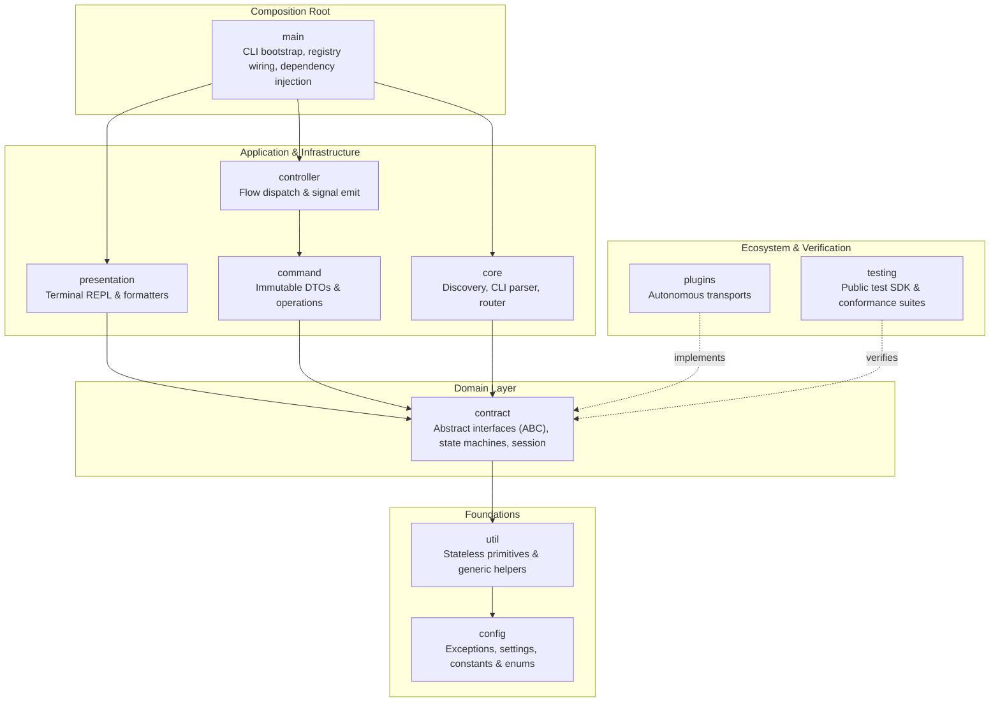

# Contributing to Declusor

Thank you for your interest in contributing to **Declusor**! This document provides the architectural principles, quality standards, coding invariants, and workflows required to contribute effectively to this repository.

## Architectural Overview & Boundaries

Declusor is architected around clean, decoupled layers with strict unidirectional dependency flow:



### Foundations

1. **`config` (Foundation Base)**:
   - Depends strictly on the standard library.
   - Centralizes domain exceptions, configuration constants, settings, and enums.
2. **`util` (Stateless Primitives)**:
   - Depends only on `config` and standard library primitives.
   - Pure, stateless helpers (encoding, network, concurrency) with zero domain knowledge.
   - Uses generic `TypeVar` annotations instead of importing contracts from higher layers.

### Domain

3. **`contract` (Domain Layer)**:
   - Depends strictly on foundation layers (`config`, `util`).
   - Defines pure abstractions (`ABC`), protocol state machines, and session context boundaries.
   - Zero dependencies on concrete implementation packages, presentation, or external plugins.

### Application

4. **`command` (Command Operations)**:
   - Depends on `contract` and foundation layers.
   - Encapsulates discrete executable operations via immutable, self-validating DTOs.
   - Fully decoupled from runtime transport mechanics and operator terminal I/O.
5. **`controller` (Application Handlers)**:
   - Depends on `contract` and `command`.
   - Thin application handlers that parse requests, construct command DTOs, and coordinate dispatching.
   - Emits structured lifecycle signals (`ControllerAction`) instead of control-flow exceptions.

### Infrastructure

6. **`core` (Infrastructure Services)**:
   - Implements infrastructure contracts defined in `contract` (CLI parser, routing, plugin registry).
   - Manages dynamic multi-tier plugin discovery and enforces contract validation barriers.
   - Operates strictly on plugin abstractions with zero knowledge of concrete transport packages.
7. **`presentation` (View Layer)**:
   - Depends on `contract` and foundation layers.
   - Manages interactive terminal REPL loops, readline history, and stream formatting.
   - Communicates with the application layer exclusively through route dispatching and lifecycle signals.

### Composition Root

8. **`main` (Composition Root)**:
   - The sole layer aware of all system components.
   - Discovers plugins, wires routers, injects dependencies, and bootstraps application lifecycles.
   - Traps unhandled errors, displays user-friendly diagnostics, and maps to deterministic exit codes.

### Ecosystem & Verification

9. **`testing` (Public Testing SDK)**:
   - Published test harness supplying deterministic, fully-typed test doubles and fixtures.
   - Provides reusable conformance suites (`PluginConformanceTestSuite`) to verify contract invariants.
   - Replaces unconstrained `MagicMock` sprawl with contract-compliant in-memory implementations.
10. **`plugins` (Autonomous Packages)**:
    - Independent, self-contained packages residing outside the core application loop.
    - Strictly implement `IPlugin`, `IPluginRuntime`, and `IConnection` domain contracts.
    - Bundle their own isolated stager templates, helper libraries, and colocated test suites.

## Development Setup

### Prerequisites

- **Python 3.11+**
- **uv** (recommended high-performance package and project manager)
- **Make** (GNU Make for standardized execution workflows)
- **Pytest** (test suite runner and assertion harness)
- **Mypy** (strict static type analysis)
- **Ruff** (high-speed linter and code formatter)

### Setting up the Environment

```bash
# Clone the repository
git clone https://github.com/othonhugo/declusor.git
cd declusor

# Option A: Fast setup using uv (Recommended)
make install
# This syncs dependencies via uv and automatically installs all plugins in editable mode.

# Option B: Manual setup using python3 venv + pip
python3 -m venv .venv
source .venv/bin/activate
pip install -e ".[dev,testing]"
pip install -e plugins/shell_socket
pip install -e plugins/py_socket
```

## Coding Standards & Invariants

### Namespace Imports

Always import the package namespace directly rather than destructuring separated symbols from deep modules:

```python
# CORRECT: Clean namespace qualification
from declusor import command, config, contract, core, presentation, testing, util

session = contract.SessionContext(...)
console = testing.DummyConsole()
cmd = command.ExecuteCommand(dto)
```

```python
# FORBIDDEN: Destructuring separated symbols across layers
from declusor.testing import DummyConsole, DummyConnection
from declusor.presentation import PromptCLI
from declusor.main.app import Application
```

### 3.2. Exception Re-exports

Each subpackage re-exports its respective domain exceptions from `declusor.config` within its `__init__.py` and in `__all__`:

- `command`: `CommandError`, `CommandValidationError`, `InvalidOperation`
- `contract`: `ConnectionClosed`, `ConnectionError`, `ConnectionHandshakeError`, `ConnectionTimeoutError`, `InvalidOperation`
- `controller`: `ControllerError`
- `core`: `ParserError`, `PluginError`, `PluginValidationError`, `RouterError`
- `presentation`: `PromptError`

When handling or raising layer-specific errors, consumers can import them directly from the relevant package namespace (e.g. `core.ParserError`, `command.CommandError`).

### 3.3. Docstring Rhythm (Blank Line Separation)

**Never glue docstrings directly to executable code.** Always insert exactly one blank line between the closing triple quotes (`"""`) of a docstring and the first line of code inside functions, methods, and nested controllers:

```python
# CORRECT
def test_something() -> None:
    """Verify that something works as expected."""

    result = compute()
    assert result is True
```

```python
# FORBIDDEN (glued docstring)
def test_something() -> None:
    """Verify that something works as expected."""
    result = compute()
    assert result is True
```

### 3.4. Package README Documentation

Every package directory must maintain a `README.md` containing at least:

1. `# <Package Name>`: Top-level section with the package name followed by a concise description of the package's role, dependencies, and architectural context.
2. `## Modules`: A markdown table with columns `Module` and `Responsibility` documenting every module in the package without empty rows.
3. `## Design Principles`: A numbered list detailing the design rationale and architectural guarantees of that layer.

### 3.5. Strict Static Typing

- All production and test code must carry complete, precise type annotations.
- `mypy src plugins tests` must pass with zero errors under `--strict`.
- Never use untyped `Any` where a generic `TypeVar`, `Protocol`, or explicit union can be defined.

## 4. Testing Guidelines

### 4.1. Mock-Free Deterministic Test Doubles

Do **not** use unconstrained `unittest.mock.MagicMock` or fragile monkeypatching to satisfy core contracts. Use the typed doubles provided by `declusor.testing`:

- `testing.DummyConsole`: Simulates I/O, error logging, and input queues.
- `testing.DummyConnection`: Full state machine (`CREATED` -> `CONNECTED` -> `CLOSED`), frame recording, and chunk streaming.
- `testing.DummyConnectionProfile`: Script rendering and command formatting.
- `testing.DummyPluginFileStore`: In-memory file, library, and module streaming.
- `testing.DummyPluginRuntime`: Deterministic connection creation.
- `testing.DummyPlugin`: Self-contained client plugin for discovery and registration tests.
- `testing.DummyRouter`: Route inspection, usage docs, and deterministic dispatching.
- `testing.DummySocket`: In-memory byte buffers simulating socket send/recv without OS network binding.
- `testing.DummyApplication`: In-memory CLI execution double tracking `parse` and `run` calls.

Standard pytest fixtures are pre-registered via `pytest_plugins = ["declusor.testing.pytest_plugin"]`:
`dummy_console`, `dummy_connection`, `dummy_file_store`, `dummy_router`, `dummy_profile`, `test_session`, `dummy_app`.

### 4.2. Colocated Plugin Tests & Conformance

- Native plugin tests live inside `plugins/<plugin_name>/tests/`.
- Every client plugin must implement contract conformance tests by inheriting from `testing.PluginConformanceTestSuite`:

  ```python
  from declusor import testing
  from declusor_plugin import DeclusorPlugin


  class TestDeclusorPluginConformance(testing.PluginConformanceTestSuite):
      plugin_class = DeclusorPlugin
  ```

## 5. Plugin Authoring Guide

All plugins must follow the autonomous package layout:

```text
plugins/<plugin_name>/
├── pyproject.toml         # Standalone package metadata & entry point
├── README.md              # Plugin documentation with ## Modules and ## Design Principles
├── src/
│   └── declusor_<plugin_name>/
│       ├── __init__.py    # Exports: __all__ = ["<PluginClass>"]
│       ├── plugin.py      # Implements IPlugin & IPluginRuntime
│       └── connection.py  # Implements IConnection, IConnectionProfile & IClientFileStore
├── assets/                # Bundled stagers and libraries
│   ├── launchers/         # Bootstrap stagers (e.g. client.py, client.sh)
│   ├── helpers/           # Library files sent during session handshake
│   └── modules/           # On-demand discovery/execution modules
└── tests/                 # Dedicated unit & conformance test suite
    ├── conftest.py
    └── test_conformance.py
```

### Entry Point Declaration

Register the plugin in `plugins/<plugin_name>/pyproject.toml`:

```toml
[project]
name = "declusor-<plugin_name>"
version = "0.1.0"
dependencies = ["declusor>=0.3.1"]

[project.entry-points."declusor.plugins"]
<plugin_name> = "declusor_<plugin_name>:<PluginClass>"
```

## 6. Verification & Quality Gates

Before opening a pull request or submitting code, ensure that all quality gates pass using the project `Makefile`:

```bash
# Run the complete verification suite (formatting check, linting, strict mypy, and tests)
make check

# Granular verification targets
make format-check       # Verify code formatting with Ruff
make format             # Automatically format code and apply safe fixes
make lint               # Run Ruff linter checks
make type-check         # Run Mypy strict type analysis across host and plugins
make test               # Run all unit, integration, and conformance tests
make compile            # Verify bytecode compilation across src, tests, and plugins

# Plugin verification targets
make check-plugin PLUGIN=<plugin_name>  # Full check for a specific plugin
make test-plugin PLUGIN=<plugin_name>   # Run tests for a specific plugin
make test-plugins                       # Run tests across all plugins
```

## 7. Git Workflow & Commit Guidelines

- **Branch Naming**: Use descriptive prefixes: `feat/<name>`, `fix/<name>`, `refactor/<name>`, `docs/<name>`, `test/<name>`.
- **Commit Messages**: Follow [Conventional Commits](https://www.conventionalcommits.org/):

  ```text
  <type>(<scope>): <short summary>

  - Detailed bullet points describing non-obvious architectural choices or rationale.
  ```

  Examples:
  - `feat(plugins): standardize autonomous plugin packages with src-layout and individual pyproject manifests`
  - `refactor(main,testing): standardize namespace imports and relative package exports`
  - `docs(readme): add modules table and design principles across all packages`
