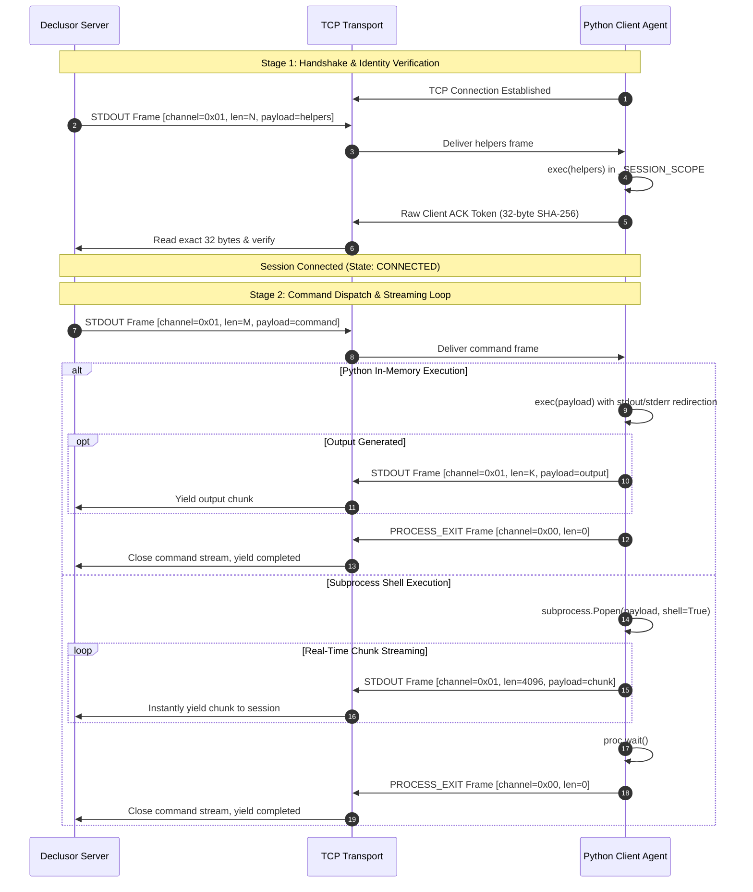
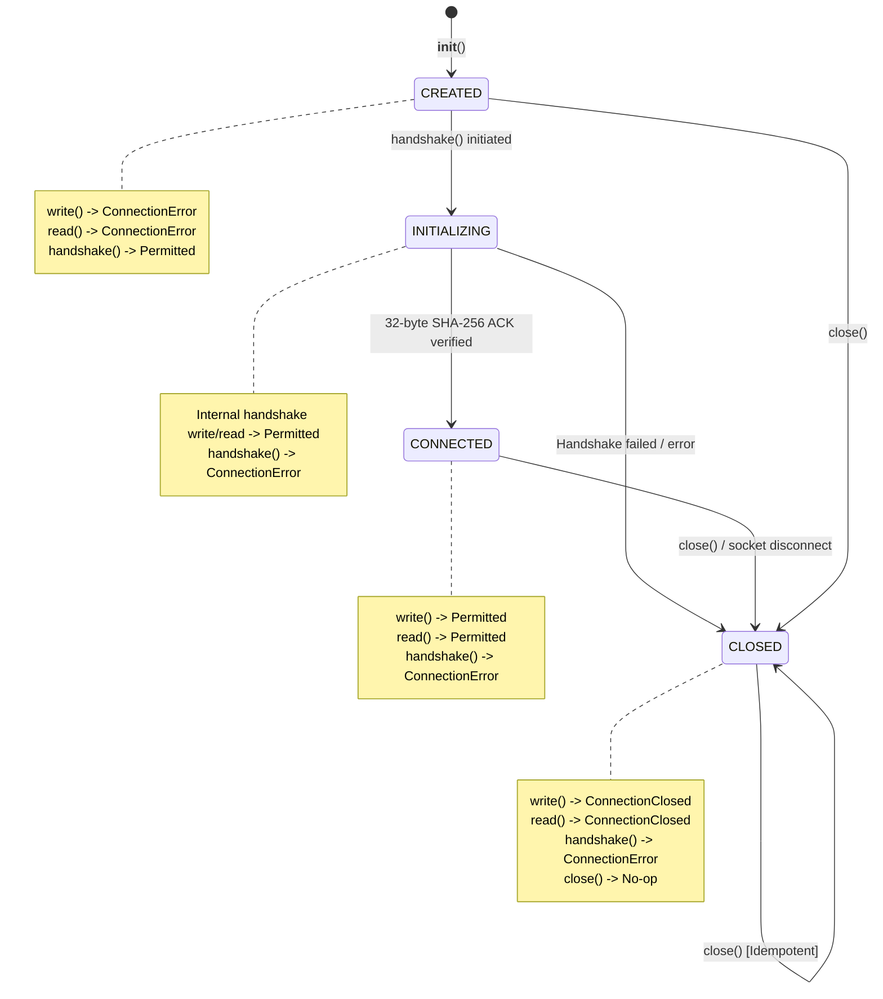

# Declusor `py_socket` Protocol Specification

This document specifies the wire protocol, framing format, channel multiplexing, and session lifecycle for the `py_socket` transport plugin in Declusor.

## Protocol Architecture & Framing Mode

The `py_socket` plugin implements the **`FramingMode.CHUNKED_TLV`** (Type-Length-Value) protocol over raw TCP byte streams.

Unlike sentinel-based protocols that scan for byte sequences or delimiters in the stream, `CHUNKED_TLV` frames data with deterministic prefix headers. This achieves:

- **Zero Delimiter Collision**: Any arbitrary byte sequence (including null bytes `\x00`, newlines, or binary blobs) can be transmitted safely without escape sequences ($P(\text{collision}) = 0$).
- **Zero Trailing Latency**: Chunks are yielded immediately upon reading their declared length, eliminating the need to buffer $k$ bytes in reserve.
- **Multiplexed Channels**: Distinct data channels (stdout, stderr, control signals, process exit code) share the same underlying stream.
- **Process Exit Propagation**: Child process termination status (`$?` / `returncode`) is communicated natively to the server.

## Binary Frame Layout

Every frame on the wire consists of a **5-byte fixed header** followed by a variable-length payload:

```text
 0                   1                   2                   3
 0 1 2 3 4 5 6 7 8 9 0 1 2 3 4 5 6 7 8 9 0 1 2 3 4 5 6 7 8 9 0 1
+---------------+-----------------------------------------------+
|  Channel (1B) |                 Length (4B)                   |
+---------------+-----------------------------------------------+
|                         Payload ...                           |
|                    (Length bytes total)                       |
+---------------------------------------------------------------+
```

### Header Fields

| Field              |        Type        | Encoding | Description                                              |
| :----------------- | :----------------: | :------: | :------------------------------------------------------- |
| **Channel ID**     |  1 byte (`uint8`)  |   `>B`   | Identifies the payload type and handling channel.        |
| **Payload Length** | 4 bytes (`uint32`) |   `>I`   | Length of the payload in bytes ($0 \le L \le 2^{32}-1$). |

### Channel Types

| Channel Code | Identifier     |          Direction          | Payload Description                                                                |
| :----------: | :------------- | :-------------------------: | :--------------------------------------------------------------------------------- |
|    `0x00`    | `PROCESS_EXIT` | Client $\rightarrow$ Server | Terminal EOF frame signaling the completion of command execution.                  |
|    `0x01`    | `STDOUT`       |       Bi-directional        | Server-to-Client command payload or Client-to-Server standard output stream chunk. |
|    `0x02`    | `STDERR`       | Client $\rightarrow$ Server | Standard error stream chunk.                                                       |
|    `0x03`    | `SIGNAL`       |       Bi-directional        | Out-of-band process signal (e.g. `SIGINT`, `SIGTERM`).                             |
|    `0x04`    | `HEARTBEAT`    |       Bi-directional        | Keep-alive probe frame (payload length may be 0).                                  |

## Session Lifecycle & State Machine

### Sequence Diagram



### Connection State Machine & Method Invariants



| Method | Permitted States | Disallowed States & Error Behavior | Resulting State |
| :--- | :--- | :--- | :--- |
| `handshake()` | `CREATED` | `CLOSED` $\rightarrow$ `ConnectionError`<br>`CONNECTED` $\rightarrow$ `ConnectionError`<br>`INITIALIZING` $\rightarrow$ `ConnectionError` | `CONNECTED` (or `CLOSED` on failure) |
| `write(data)` | `CONNECTED` (`INITIALIZING` internal) | `CLOSED` $\rightarrow$ `ConnectionClosed`<br>`CREATED` $\rightarrow$ `ConnectionError` | Unchanged |
| `read()` | `CONNECTED` (`INITIALIZING` internal) | `CLOSED` $\rightarrow$ `ConnectionClosed`<br>`CREATED` $\rightarrow$ `ConnectionError` | Unchanged |
| `close()` | `CREATED`, `INITIALIZING`, `CONNECTED`, `CLOSED` | None (Idempotent) | `CLOSED` |


## Frame Encoding & Decoding Reference

### Python Reference (Server-Side)

```python
import struct
from declusor import config


# Frame transmission:
def send_command(transport, command_bytes: bytes) -> None:
    header = struct.pack(">BI", config.ChannelType.STDOUT, len(command_bytes))
    transport.write(header + command_bytes)


# Frame reception:
def read_stream(transport):
    while True:
        header = transport.read_exact(5)
        channel, length = struct.unpack(">BI", header)

        if channel == config.ChannelType.PROCESS_EXIT:
            if length > 0:
                transport.read_exact(length)
            return

        payload = transport.read_exact(length)
        if channel in (config.ChannelType.STDOUT, config.ChannelType.STDERR):
            yield payload
```

### Python Reference (Client-Side)

```python
import socket
import struct


def send_frame(sock: socket.socket, channel: int, data: bytes) -> None:
    sock.sendall(struct.pack(">BI", channel, len(data)) + data)


def read_frame(sock: socket.socket) -> bytes | None:
    header = read_exact(sock, 5)
    if header is None:
        return None
    channel, length = struct.unpack(">BI", header)
    return read_exact(sock, length)
```
