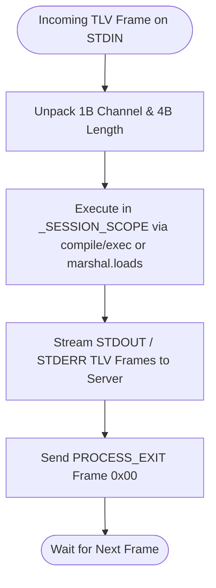
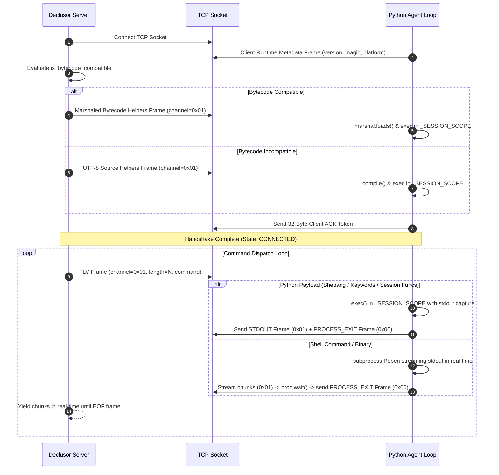

# Python Socket Plugin (`py_socket`)

The `py_socket` plugin provides a cross-platform reverse-shell client capable of executing payloads directly in-memory or delegating to the operating system shell. The agent is implemented in pure Python (standard library only), ensuring seamless execution across Linux, macOS, and Windows.

## Modules

| Module       | Responsibility                                                                                                        |
| ------------ | --------------------------------------------------------------------------------------------------------------------- |
| `connection` | Python socket connection transport (`PySocketConnection`) and operation renderer (`PySocketRenderer`)                 |
| `plugin`     | Entry-point plugin (`PySocketPlugin`), runtime adapter (`PySocketRuntime`), and asset processor (`PySocketProcessor`) |

## Architecture & Execution Flow

Execution is organized around pure communication buses (`ChannelType`) with a strictly server-driven strategy:

- **`PROCESS_EXIT` (`0x00` / `0`)**: Demarcation signal emitted by the client to indicate the end of an execution cycle.
- **`STDOUT` (`0x01` / `1`)**: Standard output stream emitted by client execution.
- **`STDERR` (`0x02` / `2`)**: Standard error stream emitted by client execution.
- **`STDIN` (`0x03` / `3`)**: Standard input and payload bus carrying instructions and data from server to client launcher.
- **`SIGNAL` (`0x04` / `4`)**: Asynchronous control signals (e.g. process termination).
- **`HEARTBEAT` (`0x05` / `5`)**: Keepalive ping and pong telemetry frames.

The server (`PySocketRenderer`) composes orthogonal client primitives (`store_file`, `execute_source`, `execute_binary`, `decode_base64`, `execute_system_command`) into ready-to-run statements. The client receives the payload on `STDIN` and executes it directly in `_SESSION_SCOPE` via native `compile()`/`exec()` or marshaled code objects without needing to classify or guess payload types.

### Handshake & Command Protocol

For wire format specifications and frame headers, see [PROTOCOL.md](PROTOCOL.md).

## Design Principles

1. **Pure Python Standard Library** — Requires zero external dependencies, guaranteeing out-of-the-box compatibility on Linux, macOS, and Windows.
2. **Dual-Mode & In-Memory Execution** — Dynamically negotiates bytecode compatibility during handshake, executing precompiled marshaled code objects or compiled Python source directly in-memory within a persistent `_SESSION_SCOPE` without touching disk, or streaming shell commands via subprocess pipes.
3. **Real-Time Subprocess Streaming** — Streams subprocess command output in 4KB chunks immediately without blocking execution or buffering complete outputs in memory.
4. **Agent Resilience & SystemExit Protection** — Wraps in-memory execution in traps catching both `Exception` and `SystemExit`, preventing client termination when scripts call `sys.exit()`.
5. **Contract Conformance** — Strictly adheres to `IPluginExtension`, `IPluginRuntime`, and `IConnection` interfaces.
6. **Zero-Disk Launcher Delivery** — Sanitizes the bootstrap client script using native AST pruning to eliminate comments, docstrings, annotations, and asserts, hex-encodes the payload, and packages it into an immediate, copy-pasteable execution wrapper (`PySocketRuntime.DEFAULT_WRAPPER_TEMPLATE`).
7. **Resilient Asset & Module Loading** — Resolves on-demand modules with or without extensions, normalizing leading `modules/` namespace prefixes to support both direct and autocompleted REPL invocation.
