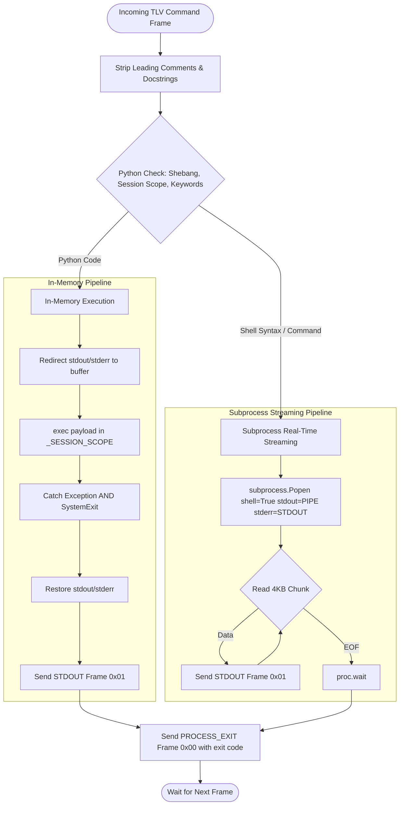
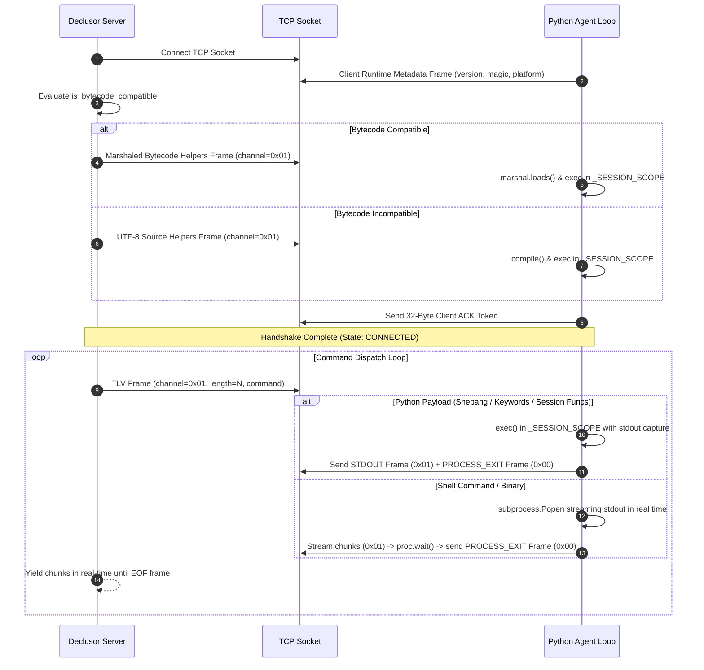

# Python Socket Plugin (`py_socket`)

The `py_socket` plugin provides a cross-platform reverse-shell client capable of executing payloads directly in-memory or delegating to the operating system shell. The agent is implemented in pure Python (standard library only), ensuring seamless execution across Linux, macOS, and Windows.

## Modules

| Module       | Responsibility                                                                                                        |
| ------------ | --------------------------------------------------------------------------------------------------------------------- |
| `connection` | Python socket connection transport (`PySocketConnection`) and protocol profile (`PySocketProfile`)                    |
| `plugin`     | Entry-point plugin (`PySocketPlugin`), runtime adapter (`PySocketRuntime`), and asset processor (`PySocketProcessor`) |

## Architecture & Execution Flow

The remote client discriminates between native Python code and shell commands using multi-line heuristic analysis (supporting shebangs, leading comments, docstrings, statements, and registered session functions).

### Handshake & Command Protocol

For wire format specifications and frame headers, see [PROTOCOL.md](PROTOCOL.md).

## Design Principles

1. **Pure Python Standard Library** — Requires zero external dependencies, guaranteeing out-of-the-box compatibility on Linux, macOS, and Windows.
2. **Dual-Mode & In-Memory Execution** — Dynamically negotiates bytecode compatibility during handshake, executing precompiled marshaled code objects or compiled Python source directly in-memory within a persistent `_SESSION_SCOPE` without touching disk, or streaming shell commands via subprocess pipes.
3. **Real-Time Subprocess Streaming** — Streams subprocess command output in 4KB chunks immediately without blocking execution or buffering complete outputs in memory.
4. **Agent Resilience & SystemExit Protection** — Wraps in-memory execution in traps catching both `Exception` and `SystemExit`, preventing client termination when scripts call `sys.exit()`.
5. **Contract Conformance** — Strictly adheres to `IPluginExtension`, `IPluginRuntime`, and `IConnection` interfaces.
6. **Zero-Disk Launcher Delivery** — Sanitizes the bootstrap client script using native AST pruning to eliminate comments, docstrings, annotations, and asserts, Base64-encodes the payload, and packages it into an immediate, copy-pasteable execution wrapper (`PySocketRuntime.DEFAULT_WRAPPER_TEMPLATE`).

