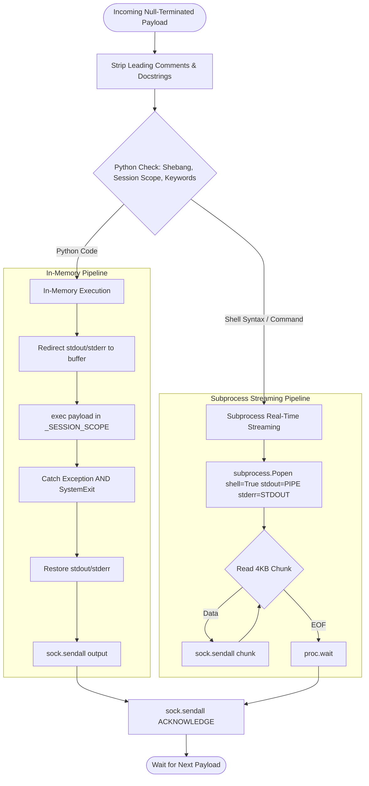
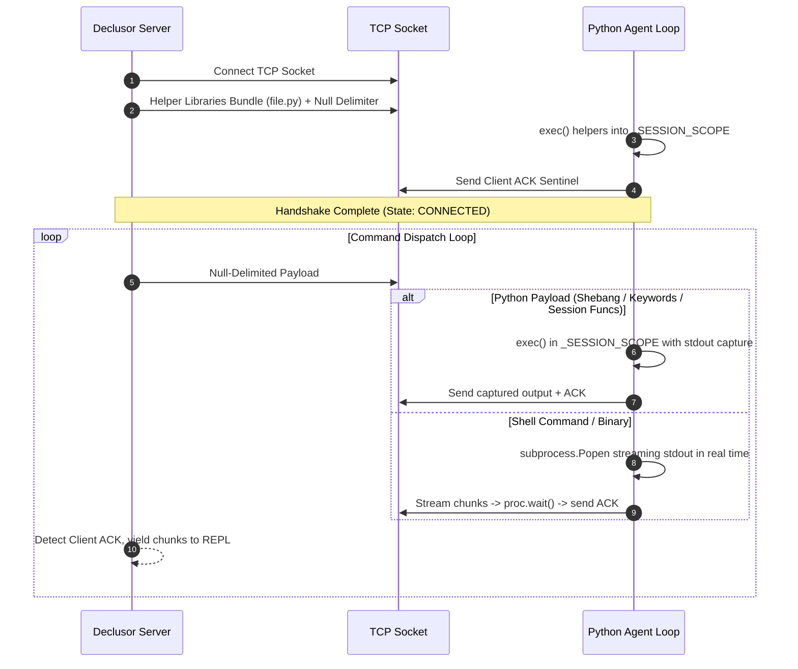

# Python Socket Plugin (`py_socket`)

The `py_socket` plugin provides a cross-platform reverse-shell client capable of executing payloads directly in-memory or delegating to the operating system shell. The agent is implemented in pure Python (standard library only), ensuring seamless execution across Linux, macOS, and Windows.

## Modules

| Module       | Responsibility                                                                  |
| ------------ | ------------------------------------------------------------------------------- |
| `connection` | Python socket connection transport, protocol profile, and asset file store      |
| `plugin`     | Entry-point plugin class (`IPluginExtension`), runtime orchestrator, and assets |

## Architecture & Execution Flow

The remote client discriminates between native Python code and shell commands using multi-line heuristic analysis (supporting shebangs, leading comments, docstrings, statements, and registered session functions).

### Handshake & Command Protocol

## Design Principles

1. **Pure Python Standard Library** — Requires zero external dependencies, guaranteeing out-of-the-box compatibility on Linux, macOS, and Windows.
2. **Dual-Mode Execution** — Dynamically evaluates Python code in-memory within a persistent `_SESSION_SCOPE` or streams shell commands via subprocess pipes.
3. **Real-Time Subprocess Streaming** — Streams subprocess command output in 4KB chunks immediately without blocking execution or buffering complete outputs in memory.
4. **Agent Resilience & SystemExit Protection** — Wraps in-memory execution in traps catching both `Exception` and `SystemExit`, preventing client termination when scripts call `sys.exit()`.
5. **Contract Conformance** — Strictly adheres to `IPluginExtension`, `IPluginRuntime`, and `IConnection` interfaces.
