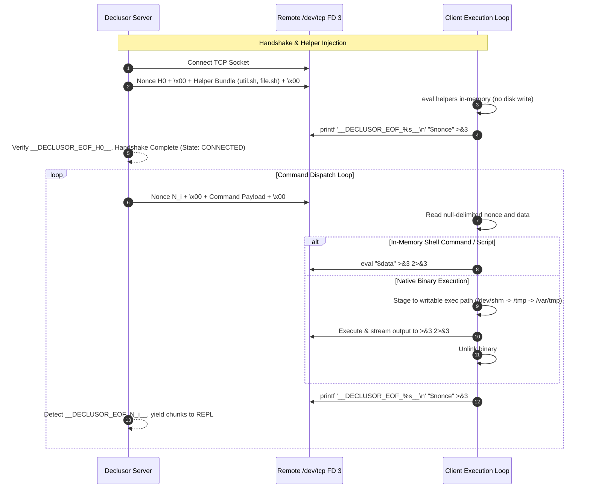

# Shell Socket Plugin (`shell_socket`)

The `shell_socket` plugin provides a lightweight, zero-dependency reverse-shell client using Linux's native `/dev/tcp` virtual file descriptor interface. It establishes an interactive bidirectional connection directly through Bash, requiring no external tools (such as `nc`, `socat`, or Python) on the target host.

For detailed specification of wire framing, nonces, and session transitions, see [PROTOCOL.md](PROTOCOL.md).

## Modules

| Module       | Responsibility                                                                                                                 |
| ------------ | ------------------------------------------------------------------------------------------------------------------------------ |
| `connection` | Reverse-shell connection transport (`ShellSocketConnection`) and protocol profile (`ShellSocketProfile`)                       |
| `plugin`     | Entry-point plugin (`ShellSocketPlugin`), runtime adapter (`ShellSocketRuntime`), and asset processor (`ShellSocketProcessor`) |

## Architecture & Protocol Flow

The client agent operates as a self-contained Bash loop utilizing file descriptor 3 mapped to `/dev/tcp`. Handshake negotiation and command execution follow an ephemeral envelope protocol where each transaction carries a dynamic 128-bit cryptographic nonce.

## Design Principles

1. **Zero External Dependencies** — Relies entirely on Python standard library on the host and Linux Bash `/dev/tcp` virtual files on the remote target.
2. **In-Memory Script Execution** — Evaluates shell helper libraries and scripts directly in-memory via subshells, bypassing disk forensics and `noexec` partition restrictions.
3. **Contract Conformance** — Strictly implements `IPluginExtension`, `IPluginRuntime`, and `IConnection` contracts.
4. **Deterministic Ephemeral Framing** — Demarcates commands with dynamic per-transaction 128-bit cryptographic nonces (`__DECLUSOR_EOF_<nonce>__`), eliminating sentinel collision risks ($P(\text{collision}) \le 2^{-128}$) without requiring pre-shared static tokens.
5. **Idempotent Lifecycle** — Guarantees safe multiple `close()` calls and deterministic lifecycle state transitions (`CREATED` -> `INITIALIZING` -> `CONNECTED` -> `CLOSED`).
6. **Zero-Disk Subshell Launcher Delivery** — Encodes the bootstrap script in Base64 and packages it inside an isolated subshell wrapper (`ShellSocketRuntime.DEFAULT_WRAPPER_TEMPLATE`), providing a self-contained one-liner that avoids shell quoting and newline collisions.
