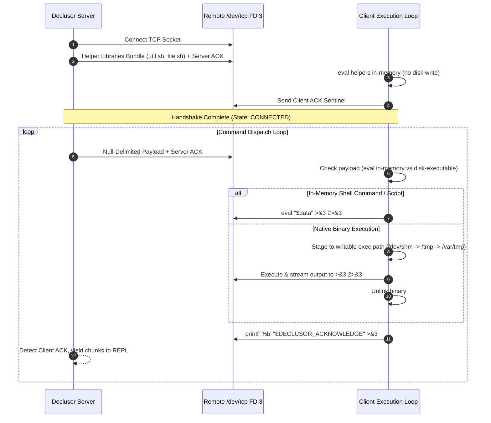

# Shell Socket Plugin (`shell_socket`)

The `shell_socket` plugin provides a lightweight, zero-dependency reverse-shell client using Linux's native `/dev/tcp` virtual file descriptor interface. It establishes an interactive bidirectional connection directly through Bash, requiring no external tools (such as `nc`, `socat`, or Python) on the target host.

## Modules

| Module       | Responsibility                                                                  |
| ------------ | ------------------------------------------------------------------------------- |
| `connection` | Reverse-shell connection transport, protocol profile, and asset file store      |
| `plugin`     | Entry-point plugin class (`IPluginExtension`), runtime orchestrator, and assets |

## Architecture & Protocol Flow

The client agent operates as a self-contained Bash loop utilizing file descriptor 3 mapped to `/dev/tcp`. Handshake negotiation and command execution follow a deterministic request-response cycle demarcated by acknowledgment tokens.

## Design Principles

1. **Zero External Dependencies** — Relies entirely on Python standard library on the host and Linux Bash `/dev/tcp` virtual files on the remote target.
2. **In-Memory Script Execution** — Evaluates shell helper libraries and scripts directly in-memory via subshells, bypassing disk forensics and `noexec` partition restrictions.
3. **Contract Conformance** — Strictly implements `IPluginExtension`, `IPluginRuntime`, and `IConnection` contracts.
4. **Deterministic Framing** — Demarcates commands with null delimiters and tracks response completion via SHA-256 segmented ACK stream markers.
5. **Idempotent Lifecycle** — Guarantees safe multiple `close()` calls and deterministic lifecycle state transitions (`CREATED` -> `INITIALIZING` -> `CONNECTED` -> `CLOSED`).
